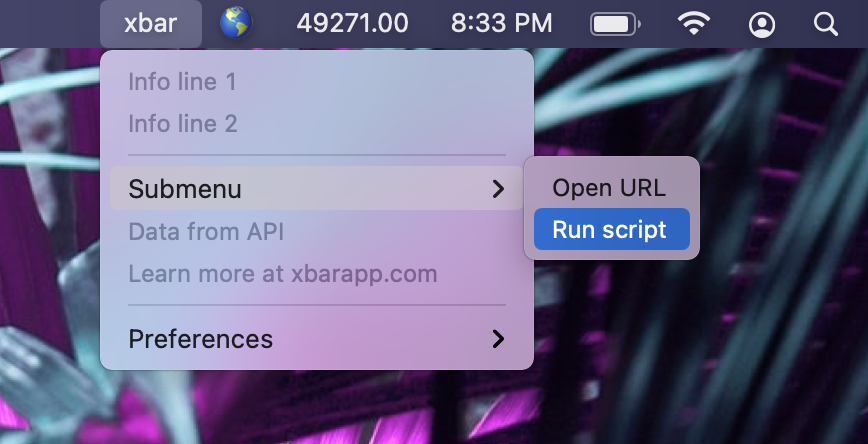

# Welcome to xbar

xbar (the BitBar reboot) lets you put the output from any script/program in your macOS menu bar.

  * **Complete rewrite from the ground up** - in Go by @matryer and @leaanthony - using [Wails.app (build cross-platform desktop apps using Go & HTML/CSS/JS)](https://wails.app)
  * Completely open source
  * [Download latest xbar release](https://github.com/matryer/xbar/releases/latest) - requires macOS Catalina or newer (>= 10.15)
  * [Visit the app homepage at https://xbarapp.com](https://xbarapp.com)
  * [Get started](#get-started) and [installing plugins](#installing-plugins)

Digging deeper:

  * [Browse plugin repository](https://xbarapp.com/)
  * [Guide to writing your own plugins](https://github.com/matryer/xbar-plugins/blob/main/CONTRIBUTING.md)

And finally...

  * [Read the story about how xbar unexpectedly got going](https://medium.com/@matryer/what-happens-when-your-old-open-source-project-unexpectedly-gets-to-the-top-of-hacker-news-31114c6c6efb#.fznvtgskb)
  * [Contributing](#contributing) and [special thanks](#thanks)

## Get started

### Install

* [Download the latest release of xbar](https://github.com/matryer/xbar/releases).

## Installing plugins

From an xbar menu, choose **Preferences > Plugins...** to use the xbar app to discover and manage plugins.

You can [browse all the plugins](https://xbarapp.com/) online, or [write your own](#writing-plugins).

### The Plugin Directory

The plugin directory is folder on your Mac where the plugins live, located at `~/Library/Application Support/xbar/plugins`.

* If you're transitioning from Bitbar, move your plugins into this new folder to install them

## Contributing

If you'd like to contribute a plugin, head over to https://github.com/matryer/xbar-plugins to get started.

Please do not send pull requests to this repo. Open an issue and start a conversation first. PRs will likely not be accepted.

* Get started with our [Writing plugins guide](https://github.com/matryer/xbar-plugins/blob/main/CONTRIBUTING.md)

## Thanks

  * Special thanks to [@leaanthony at https://wails.app](https://wails.app) and [@ianfoo](https://github.com/ianfoo), [@gingerbeardman](https://github.com/gingerbeardman), [@iosdeveloper](https://github.com/iosdeveloper), [@muhqu](https://github.com/muhqu), [@m-cat](https://github.com/m-cat), [@mpicard](https://github.com/mpicard), [@tylerb](https://github.com/tylerb) for their help
  * Thanks to [Chris Ryer](http://www.chrisryer.co.uk/) for the app logo - and to [@mazondo](https://twitter.com/mazondo) for the original
  * Thanks for all our [plugin contributors](https://xbarapp.com/) who have come up with some pretty genius things
