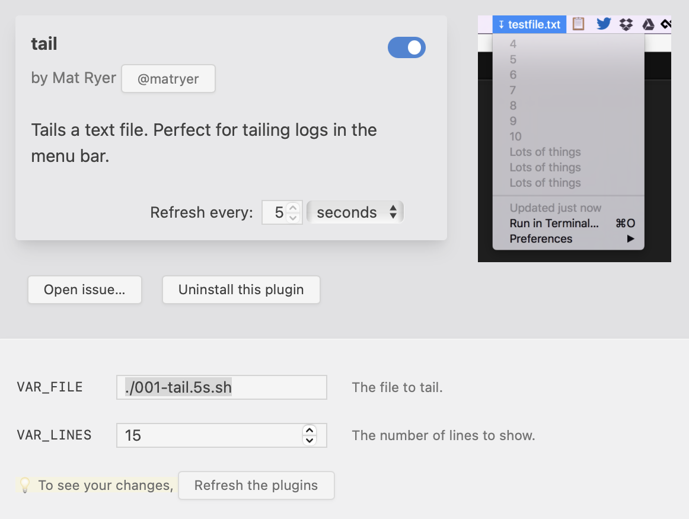

Plugin authors are upgrading their plugins to make use of new xbar features.

# Your plugin already works

Your BitBar plugin works the same in xbar without any changes.

# But you should make some tweaks

* The `bash` parameter is now `shell`
* There is now no limit to the number of `paramN` parameters you can use

# Plus, there are new features

xbar brings a few new features that you may like to make use of in your plugin.

## Keyboard shortcuts

xbar lets you specify keyboard shortcuts for your menu items.

Use the `key` parameter:

```
Let's go | key=shift+g | href=https://xbarapp.com/
```

You can specify a range of modifiers and special keys, for a full list check out the [Parameters documentation](https://github.com/matryer/xbar#parameters).

## Variables

Instead of asking users to edit your plugin script in order to configure the script, xbar introduces Variables.



Variables are defined in your plugin's metadata. The xbar UI lets users configure the values without editing your script.

To make it work:

1. Add the `xbar.var` metadata to your plugin code (read the [Metadata documentation](https://github.com/matryer/xbar#metadata))
1. Remove any previous variables
1. Get the values by using environment variables

# Please try xbar, and report any issues

xbar is still brand new, so please help us reach a full release by reporting any issues you find.
