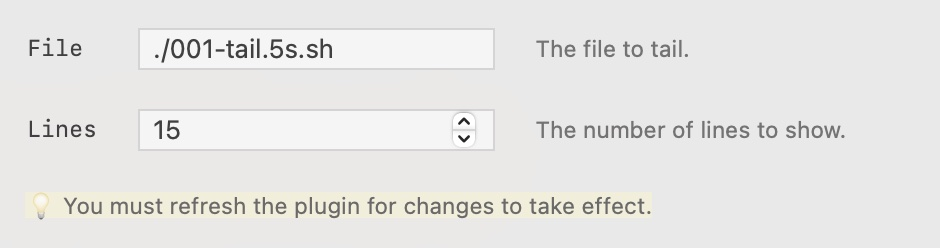

xbar plugins can now define Variables in their metadata. End users will be prompted to input the values when they install the plugin.

The [new xbar app](https://github.com/matryer/xbar/releases/latest) renders variables like this:



## Use cases

Variables are great for:

* API keys or tokens that your plugin needs
* Different style or presentation options
* Letting users decide how many items to show

## Defining variables

To define variables for your plugin, use `xbar.var` tags.

```
<xbar.var>type(NAME=default): description [options]</xbar.var>
```

* `type` - the kind of field (can be `string`, `number`, `boolean`, or `list`)
* `NAME` - the name of the variable (will become an environment variable when the plugin runs)
* `default` - the default/initial value for this variable
* `description` - a short label describing the variable
* `[options]` - for `list` types, a comma separated list of option strings

Some examples include:

```html
#  <xbar.var>string(VAR_NAME="Mat Ryer"): Your name.</xbar.var>
#  <xbar.var>number(VAR_COUNTER=1): A counter.</xbar.var>
#  <xbar.var>boolean(VAR_VERBOSE=true): Verbose or not?</xbar.var>
#  <xbar.var>list(VAR_STYLE="normal"): Which style to use. [small, normal, big]</xbar.var>
```

### List options

The `[small, normal, big]` in the example above shows the valid options. It is required for `list` types.

## Using variables in your plugin

The `NAME` you use in the metadata will become the environment variable that holds the value input by the user.

```bash
#  <xbar.var>string(VAR_NAME="World"): Your name.</xbar.var>
echo "Hello, ${VAR_NAME}"
```

* Remember: Environment variables are always strings

## Values are stored in sidecar JSON files

Variables are stored in JSON files alongside your plugin. The key is the name of the Variable as well as the name of the environment variable. The values are the user's preferences, usually input through the xbar app.

For example, the variables file for the `tail.5s.sh` plugin looks like this:

```json
tail.5s.sh.vars.json
{
	"VAR_FILE": "./001-tail.5s.sh",
	"VAR_LINES": 15
}
```

## Plugins using Variables are more likely to get featured

When deciding which plugins to feature, we are planning on prioritising plugins that make use of more modern xbar features. It shows they're recently tested and verified to be working, and it shows that the maintainer(s) are still involved.